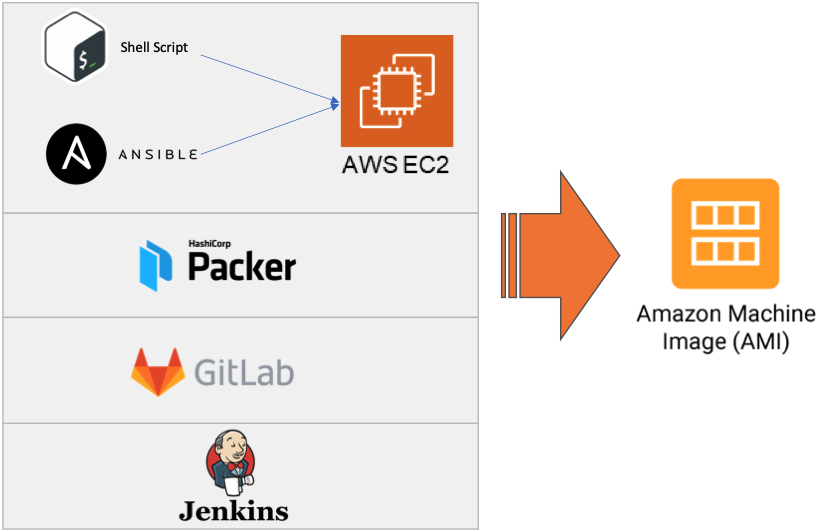
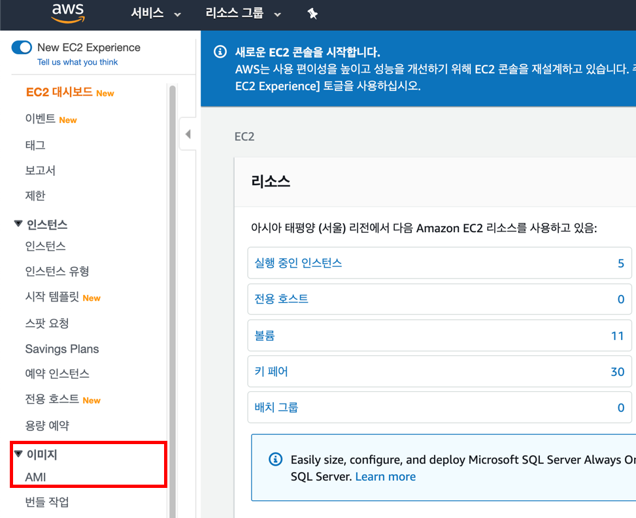
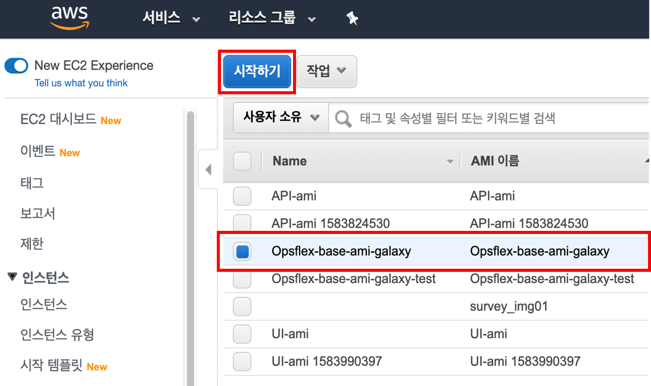

# AMI  생성 가이드라인
## 1. 용어설명
```
AMI(Amazon Machine Image): 인스턴스를 처음 셋업할 때 지정하는 소프트웨어 구성이 기재된 템플릿입니다.
프로비저닝(Provisioning): 사용자의 요구에 맞게 서버를 설정해 두었다가 필요 시 서버를 즉시 사용할 수 있는 상태로 미리 준비해 두는 것을 말합니다.Packer: 여러 플랫폼에 대해 동일한 시스템 이미지를 작성하기위한 오픈 소스 도구입니다.
Ansible: 프로비저닝에 대한 자동화를 제공하는 소프트웨어입니다. yaml 문법으로 작성한 ansible 파일을 통해서 프로비저닝 설정들을 관리할 수 있습니다.
Scale Out: 서버의 대수를 늘려서 처리 능력을 향상시키는 것을 말합니다.
AWS Auto Scaling Group: 인스턴스 조정 및 관리 목적으로 구성된 Amazon EC2 인스턴스들의 묶음입니다. 운영 시 Scale Out이 빈번하게 일어나기 때문에 Auto Scaling Group을 사용하게 됩니다.
```
## 2. 아키텍처


## 3. 구동방법
### 3.1. git checkout
    /* make directory */
    $ cd ~
    $ mkdir workspace
    $ cd workspace

    /* git clone */
    $ git clone https://github.com/pe-woongjin/ami.git
    $ cd ~/workspace/ami

### 3.2 Role 편집
    $ vi ~/workspace/ami/packer/playbook.yml

    [ Role 선택 방법 ]
        사용할 role 추가 및 편집
        사용하지 않는 role은 #을 통해 주석 처리

    [ gitlab-ce.yml ]
    ---
    - import_playbook: "../playbook/roles/gitlab/tasks/main.yml"


    [ nexus+jenkins.yml ]
    ---
    - import_playbook: "../playbook/roles/java/tasks/main.yml"
    - import_playbook: "../playbook/galaxy/nexus/main.yml"
    - import_playbook: "../playbook/galaxy/maven/main.yml"
    - import_playbook: "../playbook/roles/gradle/tasks/main.yml"
    - import_playbook: "../playbook/galaxy/jenkins/main.yml"


### 3.3. Packer bild
#### 생성할 OS 환경에 따라 build 폴더로 이동하여 build 실행
##### 3.3.1 aws linux2 build (packer build json파일)
    $ cd ~/workspace/ami/packer/build_awslinux2
    $ packer build jenkins-ami.json
##### 3.3.2 ubuntu build (packer build json파일)
    $ cd ~/workspace/ami/packer/build_ubuntu
    $ $ packer build jenkins-ami.json


## 4. Packer + Ansible Toolchain 이미지 확인
#### 4.1. AWS Console 로그인
     https://console.aws.amazon.com/

#### 4.2. AMI 확인
     서비스 > EC2 > 이미지 > AMI 에서 생성된 이미지 확인


#### 4.3. AMI 로 EC2 인스턴스 생성
     생성된 이미지 선택 > '시작하기' 버튼을 클릭하여 EC2 인스턴스 생성


#### 4.4. EC2 인스턴스에서 설치된 항목 확인
     생성된 EC2에 접속하여 설치 리스트 확인
