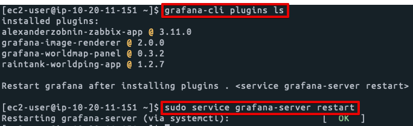
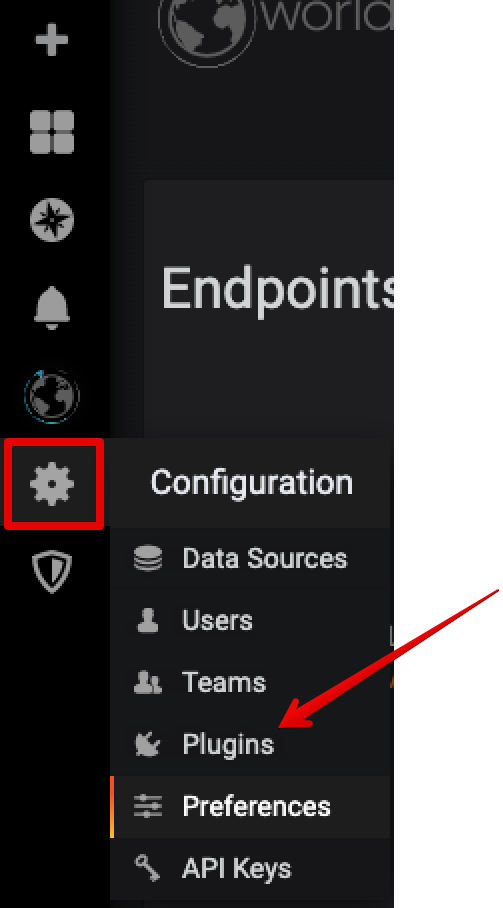
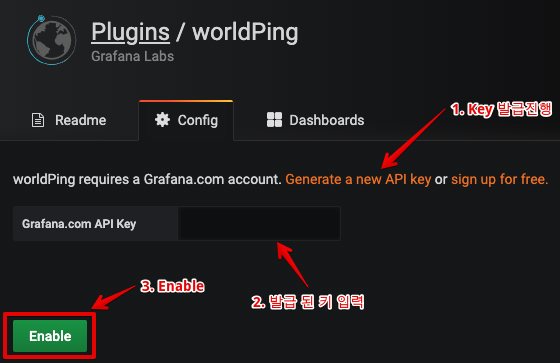
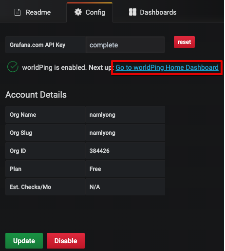
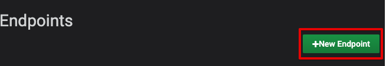
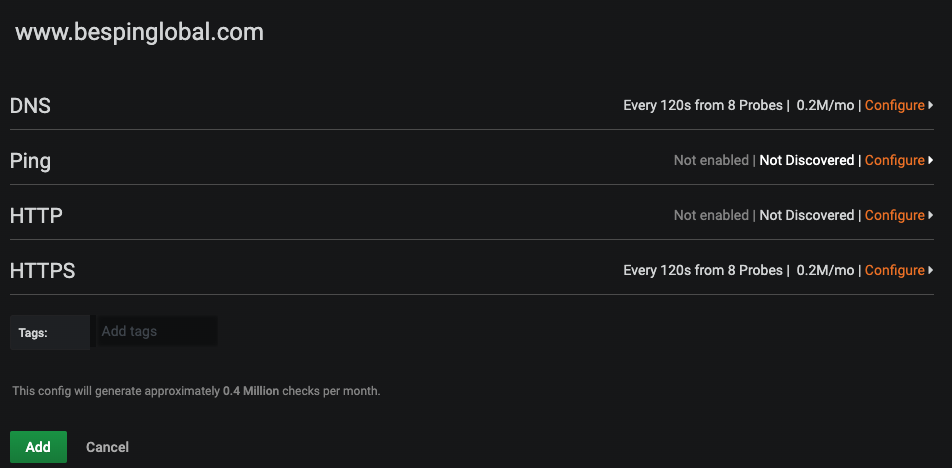
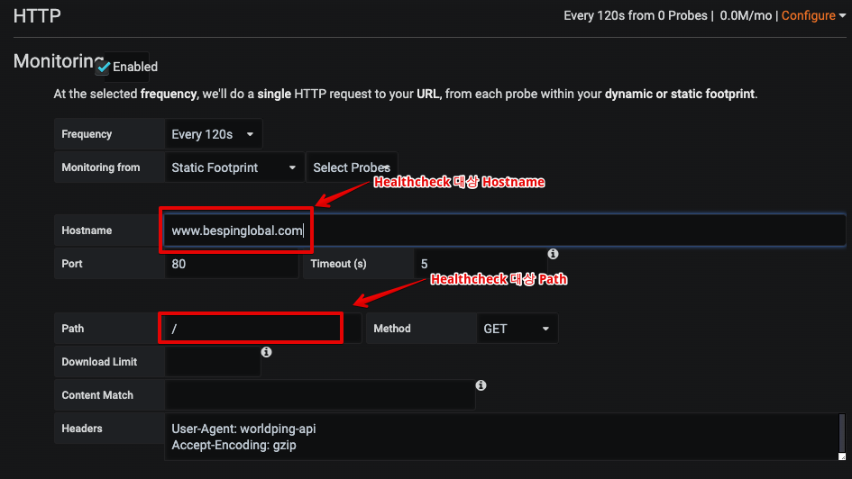

### 인스턴스 생성

### Grafana 초기 설정

### Plug-in 설치

- worldping : (전세계에서 Ping 응답 속도 확인)
- Image-renderer : (Slack 알람 시, 이미지 포함)
- worldmap-panel : 월드맵 상에서 데이터를 점으로 표현. Elasticsearch, GeoHash Data를 사용 할 수 있음
- alexanderzobnin-zabbix-app : zabbix 연동을 위한 plugin

```
sudo grafana-cli plugins install raintank-worldping-app

sudo grafana-cli plugins install grafana-image-renderer

sudo grafana-cli plugins install grafana-worldmap-panel

sudo grafana-cli plugins install alexanderzobnin-zabbix-app
```


- 플러그인 설치 리스트 확인
```
grafana-cli plugins ls
sudo service grafana-server restart
```




### WorldPing 설정







Plug-In 중 worldPing 선택




End Point 입력









