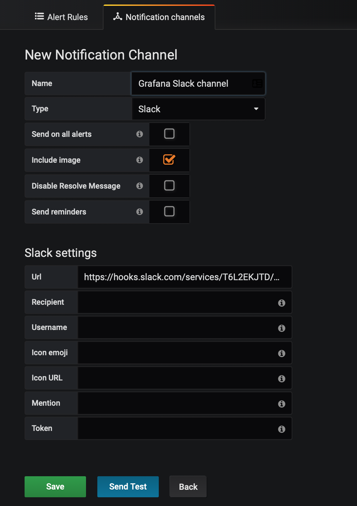

# Grafana Guide

### 목차

1. 사전 준비 사항
2. 설치 방법
3. Alert 설정 방법

## 사전 준비

- Slack Webhook 설정

- Grafana Instance 생성 

- Plug-in

  

## Grafana 설치하기

초기계정 및 패스워드 : admin / admin

## Alerting Setting

### Step1. 환경설정

- Datasource 설정 선택 시, CloudWatch Plug-In 설정

### Step2. Notification Channel 설정

[Alerting] -> [Notification Channels] -> [New Channel] -> 

### Step3. Slack 새로운 채널 생성 또는 선택

Grafana 알람을 수신하기 위한 채널을 생성하거나, 선택 하도록 합니다.

기존 채널에 수신 하기 보다는, 알람 전용 채널을 만드는 것을 권고하기에 새로 만드는 방법을 보여드립

> [Slack] -> [Channels] 의 "+" 버튼 눌러주면 아래와 같이 채널 생성 가능

### Step 4. Grafana App 을 위한 Webhook 생성 및 활성화

Webhook을 사용하기 위해서는 Slack의 Webhook App 필요합니다.

자세한 내용은 아래 링크 참고 <https://github.com/bsp-pe/slack_notification_guide>

`https://{WorkspaceName}.slack.com/apps/manage/custom-integrations`

>  Integrations App 설치 (Incoming WebHooks) -> Configureation 설정

### Step 5. 채널 설정

Name : Grafana에서 식별 할 수 있는 이름 지정

Type : Slack 선택

Url : Slack Webhook URL 입력

### Step 6. Notification Test

> [Send Test] 버튼을 통해서 Slack Channel에 알람이 발생 하는ㄴ

> 테스트 시 Slack으로 전송 되는 메시지

## 

