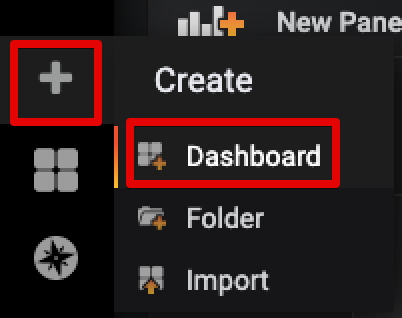
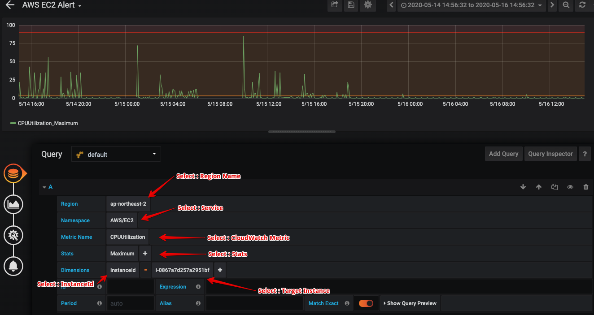
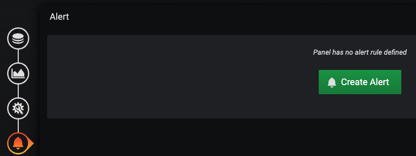
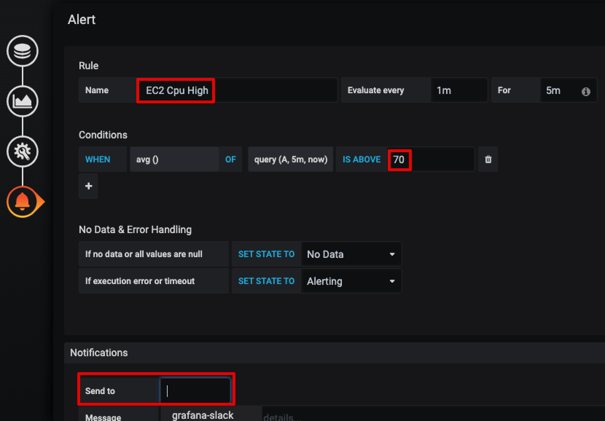

## Alert 생성하기

#### Step 1. Dashboard 생성

"CPU Uilization" 패널을 생성 하기 위해서는 아래와 같이 Dashboard에서 Panel을 추가 해야 합니다.

#### Step 2. Alert Panel 설정 하기

##### Query : 

> Query 대상 선택 : Data Source를 선택 (CloudWatch) 
>
> Region : Region 정보 선택
>
> Namespaces : 서비스 선택
>
> Metric Name : 대상 CloudWatch Metric
>
> Stats : Max, Avg, Min 값 중 선택
>
> Dimensions : Target 대상 선택

##### Alert :

> [Create Alert]

> Rule Name : Rule 네임 생성
>
> Conditions : 알람을 발생 시킬 조건 생성
>
> Notifications : [사전 설정에서 생성 한 grafana-slack을 선택]

> Control + S 를 통해서 Dashboard 저장 or 
>
> 상단의 "Save Dashboard" 을 통해 저장.

