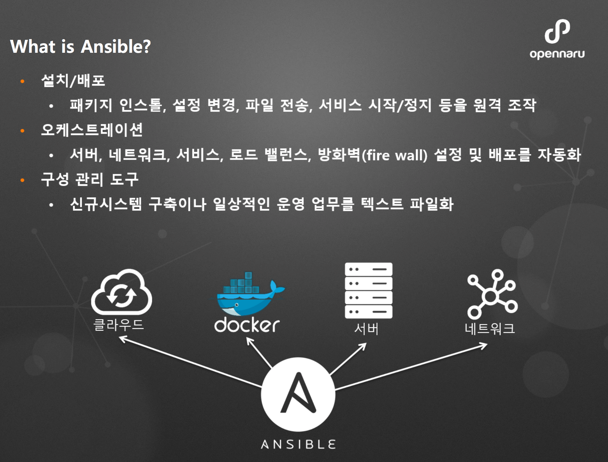
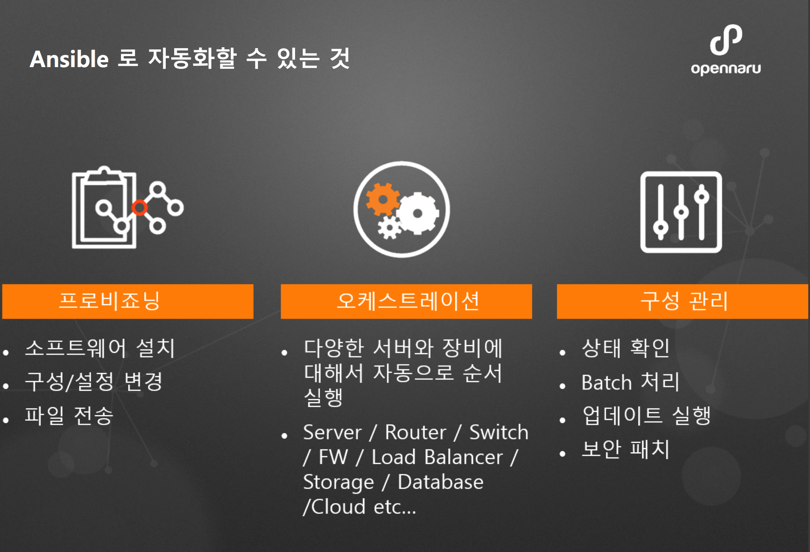
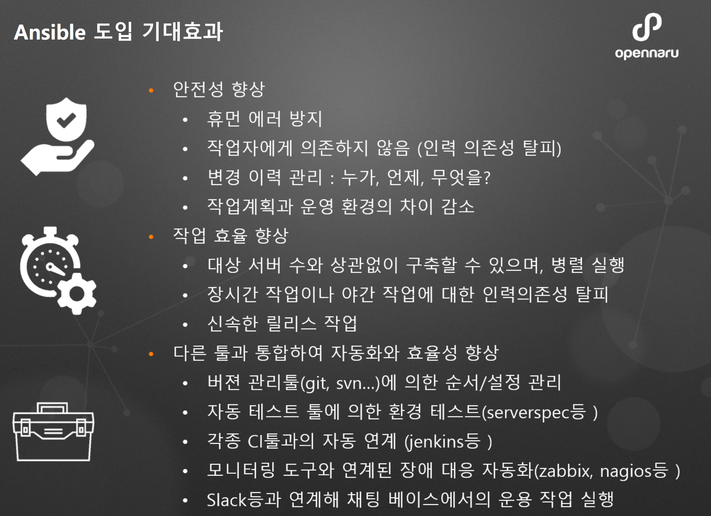

# **Ansible 공유**
---
## 1. Ansible 소개

## 2. ansible 자동화

## 3. ansible 도입효과

## 4. mkdocs 생성 및 실행
> - mkdocs 생성
~~~
$ cd ~/workspace/ami
$ mkdocs new mkdocs
~~~
> - mkdocs 실행
~~~
$ cd ~/workspace/ami/mkdocs
$ mkdocs serve
~~~
> - mkdocs 빌드
~~~
 $ cd ~/workspace/ami/mkdocs
 $ mkdocs build
~~~
> - mkdocs deploy
~~~
 $ cd ~/workspace/ami/mkdocs
 $ mkdocs gh-deploy
~~~
