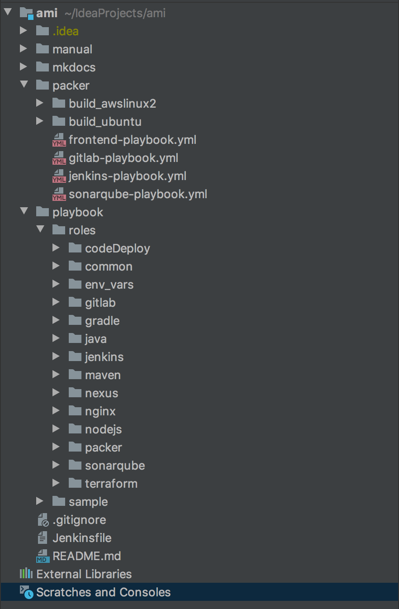

# **Directory 구조**
---
## 1. 전체 디렉토리 구조

## 2. 디렉토리 구조 설명
### 1) manual
> README.md 가이드 문서에 사용하는 메뉴얼 폴더
### 2) mkdocs
> mkdocs 가이드 문서를 구성하는 파일 폴더  
> 실행방법 :  
~~~
$ cd ~/workspace/ami/mkdocs
$ mkdocs serve
~~~
### 3) packer
> packer를 사용하여 ansible playbook을 호출한다.
>> - build_awslinux2
>>> awslinux2 환경에 맞춰 사용할 packer list
>> - build_ubuntu
>>> ubuntu 환경에 맞춰 사용할 packer list
### 4) playbook
> ansible playbook 내용이 들어간다.
>> - roles
>>> ansible 에 설치되는 role의 종류에 따라 나눠진다. 
>>> role안에는 `tasks`와 `vars`로 나눠진다.
>>>> - tasks
>>>>> ansible을 수행하는 yml 파일
>>>> - vars
>>>>> tasks에서 사용하는 변수